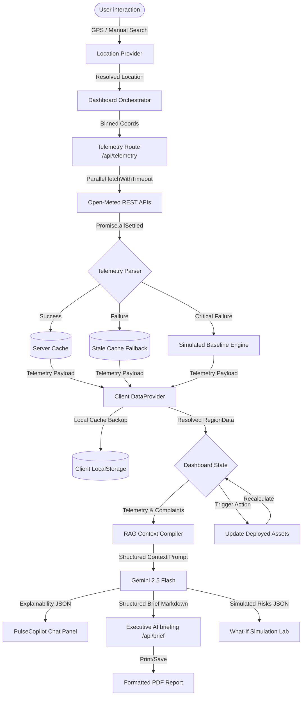

# CommunityPulse AI
> **AI-Powered Decision Intelligence for Smarter, Safer, and Healthier Communities.**

---

[](https://nextjs.org/)
[](https://react.dev/)
[](https://www.typescriptlang.org/)
[](https://deepmind.google/technologies/gemini/)
[](https://tailwindcss.com/)
[](https://opensource.org/licenses/MIT)
[](#)
[](#)

---

## 📸 Platform Interface Preview

<p align="center">
  
</p>

*Above: A mockup of the CommunityPulse AI Command Operations dashboard. It highlights localized GIS hot spots, real-time KPI data, PulseCopilot explainability logs, and the What-If simulation laboratory.*

---

## 💡 Elevator Pitch

Modern communities generate staggering amounts of data through IoT arrays, weather stations, transit loops, and citizen complaints. However, this raw data is typically siloed and disconnected. For municipal administrators, emergency coordinators, and local citizens, turning these rapid streams of telemetry into immediate, coordinated, and safe public action remains a significant challenge.

**CommunityPulse AI** bridges this gap. It is a production-grade, containerized **Decision Intelligence Platform** that integrates real-time environmental APIs, reverse geocoding services, and citizen sentiment metrics. Using a grounded **Retrieval-Augmented Generation (RAG)** architecture, the platform fuels a conversational AI Copilot (**PulseCopilot**) and an automated briefing compiler, helping users quickly understand community risks.

By combining real-time geolocated context, a **What-If Scenario Simulator**, and **Closed-Loop Action Orchestration**, the platform enables municipal teams to execute recommended protocols (e.g. air purifiers, heat cooling shelters) and dynamically trace their impacts on local risks. It empowers stakeholders to move from passive monitoring to responsive, data-driven planning.

---

## 🌟 Key Features

* **🤖 PulseCopilot AI**: Conversational copilot grounded in localized context. Explains complex risk indexes, recommends mitigations, and provides reasoning logs.
* **🧪 What-If Scenario Simulator**: Speculative lab card that lets users input hypothetical environmental stress levels (AQI spikes, extreme heat, severe gridlocks) and analyze projected municipal strains.
* **📄 Executive AI briefings**: Compiles real-time metrics, active warnings, and recommendations into highly polished situation reports downloadable as vector PDFs.
* **🌍 Dynamic Location Resolution**: Automatically detects user coordinates via browser GPS, falling back to cached coordinates or coarse IP detection. Also includes manual search capabilities.
* **🟢/🟡/🔵 Telemetry Freshness Badges**: Indicators next to every card revealing the data source: Live API (🟢), Cached Storage (🟡), or Simulated Engine (🔵).
* **🌫️ Air Quality & Weather API Integration**: Resolves current localized outdoor environments (PM2.5, apparent temperature, relative humidity, wind speed, UV index) in parallel.
* **🧠 Grounded RAG Pipeline**: Restricts Gemini's outputs to retrieved data, eliminating hallucinations. If data is unavailable, it acknowledges uncertainty.
* **🔄 Background Polling & Non-Disruptive Sync**: Automatic telemetry polling (Off, 1m, 5m, 15m) with user notification banners. Refreshes do not silently overwrite active inputs.
* **🚨 Closed-Loop Control**: Simulates resource deployment. Allocating active units (e.g., cooling shelters) directly lowers local risks and updates charts.
* **📱 Apple Keynote-Grade Onboarding**: First-time animated onboarding sequence complete with a programmatically generated Web Audio synthesizer soundtrack and canvas particle networks.
* **♿ WCAG AA Compliant**: Supports keyboard shortcuts, prefers-reduced-motion triggers, high-contrast text ratios, and screen readers.

---

## 🎬 Animated Workflow Diagram



---

## 🛠️ Technology Stack

| Layer | Technology | Purpose |
|---|---|---|
| **Core Framework** | Next.js 16.2 (App Router) | High-performance server rendering, static optimization, and API route hosting. |
| **User Interface** | React 19.0 & TypeScript | Type-safe declarative components and responsive layout state trees. |
| **Styling** | Tailwind CSS v4.0 | Modern utility classes, glassmorphic filters, and theme variables. |
| **AI Models** | Google Gen AI SDK (`@google/genai`) | Streamlined interfaces to call `gemini-2.5-flash` natively. |
| **Data Viz** | Recharts v2.0 | Fluid historical area curves, signal queues, and KPI trends. |
| **Maps** | Leaflet & React-Leaflet | Geographic rendering of neighborhoods, reverse geocodes, and particulate dispersion overlays. |
| **Acoustics** | Web Audio API | Real-time programmatic synthesis of ambient background pads. |
| **Graphics** | HTML5 Canvas | Lightweight particle network background running at 60fps. |

---

## 🔍 Feature Showcase

### 1. PulseCopilot AI
A conversational sidebar powered by `gemini-2.5-flash`. Instead of basic Q&A, it ingests RAG context (telemetry, complaints, deployed resources) and structures responses clearly:
* **Observed Facts**: Real-time sensor metrics and warning alerts.
* **Historical Trends**: Compares current metrics to baselines.
* **Forecasts**: Projects conditions for the next 24-72 hours.
* **Recommendations**: Suggests priority mitigation actions.

It prints grounding sources and reasoning confidence metrics directly in the chat bubble footer.

### 2. Executive AI briefing
A PDF compilation tool hosted at `/api/brief`. Clicking "Generate Executive AI Brief" prompts Gemini to assemble a daily municipal report. The output is structured strictly into five sections (Executive Summary, Observed Facts, Trends, Forecasts, and Recommendations) and renders in a print-styled modal that complies with standard PDF/paper dimensions.

### 3. What-If Scenario Simulator
A sandbox modeling card powered by `/api/simulate`. It allows users to simulate extreme conditions, such as AQI reaching 180 or temperatures hitting 42°C, and evaluates the downstream stress on municipal health clinics, energy grids, and transit networks. 
All outputs display a warning banner: `⚠️ Scenario Simulation — This represents a hypothetical projection and not current reality.` and include confidence levels and assumptions.

### 4. Interactive GIS Map Layers
Includes a dual map system:
* **Geographic Map**: Uses Leaflet tiles centered on the user's geolocated city. It draws gradient PM2.5 and thermal rings that scale based on local metrics.
* **Vector Schematic Map**: A custom SVG-based map layout designed for low-power devices, offline rendering, and dark dashboards.

### 5. Dynamic Geolocation Resolver
Follows a structured cascade to resolve the user's location without defaults:
1. **Browser GPS**: Checks `navigator.geolocation` (requires explicit user consent).
2. **Local Cache**: Fallback to previously resolved locations.
3. **IP Resolution**: Reverse-lookup via IP API services.
4. **City Search**: Provides a manual search bar to lookup and reverse-geocode coordinate zones globally.

---

## 📁 Directory Architecture

```
/
├── Dockerfile                  # Multi-stage production container build config
├── package.json                # Project scripts, Leaflet, Recharts, and Google Gen AI dependencies
├── tsconfig.json               # TypeScript compiler rules
├── src/
│   ├── types/
│   │   └── index.ts            # Type contracts (RegionData, Complaint, Recommendation, etc.)
│   ├── services/
│   │   ├── dataProvider.ts     # Client telemetry provider (caching, timeouts, offline fallbacks)
│   │   ├── locationService.ts  # Browser Geolocation, IP APIs, and Reverse Geocoding providers
│   │   ├── mockData.ts         # Base database records, history trend curves, and mock values
│   │   └── ragContext.ts       # RAG grounding prompt assembler
│   ├── app/
│   │   ├── page.tsx            # Main layout orchestrator, sync timers, and update banners
│   │   ├── layout.tsx          # HTML headers, metadata, and Inter font weights
│   │   ├── globals.css         # Global variables, dark theme variables, and Leaflet overrides
│   │   └── api/
│   │       ├── telemetry/      # Parallel fetching and coordinate binned cache endpoint
│   │       ├── brief/          # Grounded daily briefing compiler endpoint
│   │       ├── simulate/       # Speculative what-if evaluation endpoint
│   │       └── chat/           # PulseCopilot RAG-grounded chat endpoint
│   └── components/
│       ├── IntroExperience.tsx # Animated first-visit intro card and synth coordinator
│       ├── LandingPage.tsx     # Hero welcome landing page and persona selector
│       ├── DashboardHeader.tsx # Navigation, Clock, Alerts, Sync buttons, and Interval selects
│       ├── LocationBanner.tsx  # Dynamic GPS triggers, errors, and manual city search box
│       ├── KpiGrid.tsx         # Responsive KPI summaries with data origin indicators
│       ├── InteractiveMap.tsx  # Leaflet map container and schematic switcher controls
│       ├── LeafletMap.tsx      # Geographic Leaflet tile marker overlays
│       ├── AnalyticsCharts.tsx # Recharts historical timelines (AQI, temperature, transit)
│       ├── CopilotPanel.tsx    # PulseCopilot chat panel and explainability accordion logs
│       ├── AlertsPanel.tsx     # Active warning incidents lists and mitigation triggers
│       └── ReportGenerator.tsx # Situation Brief preview drawer and PDF compiler
```

---

## 🚀 Setup & Installation

### 1. Clone & Install
```bash
git clone https://github.com/yashgupta29032006/CommunityPulse-AI.git
cd CommunityPulse-AI
npm install
```

### 2. Environment Configuration
Create a `.env.local` file in the root folder:
```bash
cp .env.example .env.local
```
Add your Google Gemini API Key:
```env
GEMINI_API_KEY=AIzaSyYourGeminiApiKeyHere
```
> [!NOTE]
> **Failsafe Engine Active**: If no `GEMINI_API_KEY` is supplied, the server automatically routes queries to a smart local heuristic engine. This allows reviewers to test the chat panel, briefs, and simulations offline.

### 3. Run Development Server
```bash
npm run dev
```
Access [http://localhost:3000](http://localhost:3000) on your browser.

### 4. Build & Run Production Bundle
```bash
npm run build
npm run start
```

---

## 🐳 Docker Deployment

### 1. Build Production Container
```bash
docker build -t community-pulse-ai .
```

### 2. Run Container Locally
Run the container, passing your Gemini API Key:
```bash
docker run -p 3000:3000 -e GEMINI_API_KEY="your_api_key_here" community-pulse-ai
```
Access the application at [http://localhost:3000](http://localhost:3000).

---

## ☁️ Google Cloud Run Deployment

Deploy your containerized platform directly to Google Cloud Run in three simple commands:

### Prerequisites
1. Install the Google Cloud CLI (`gcloud`).
2. Log in and configure your target project:
   ```bash
   gcloud auth login
   gcloud config set project [YOUR_PROJECT_ID]
   ```

### Step 1: Build & Submit to Artifact Registry
Use Cloud Build to build the image and push it to Google Artifact Registry:
```bash
gcloud builds submit --tag gcr.io/[YOUR_PROJECT_ID]/community-pulse-ai
```

### Step 2: Deploy to Cloud Run
Deploy the container, injecting the Gemini API key securely. Enable public unauthenticated access for submission testing:
```bash
gcloud run deploy community-pulse-ai \
  --image gcr.io/[YOUR_PROJECT_ID]/community-pulse-ai \
  --platform managed \
  --region asia-southeast1 \
  --set-env-vars GEMINI_API_KEY="[YOUR_GEMINI_API_KEY]" \
  --allow-unauthenticated
```
*(Replace `asia-southeast1` with your preferred region, e.g. `us-central1` or `australia-southeast1`).*

### Step 3: Access Deployment
Once completed, the terminal will print a service URL (e.g. `https://community-pulse-ai-xxxxxx-as.a.run.app`). Your APAC Challenge submission is now live, containerized, and scaling on Google Cloud!

---

## 🧠 AI Pipeline

```
[User Location Coords]
         ↓
[Query Weather & AQI APIs] (Promise.allSettled)
         ↓
[Coarse Coordinate Binned Cache] (Server-Side Map)
         ↓
[RAG Context Compiler] (Compiling local metrics, complaints, active alerts, resources)
         ↓
[Gemini 2.5 Flash API] (Instructed to reason strictly within RAG scope)
         ↓
[Grounded JSON Response]
   ├─► content (Markdown formatted text separating Facts, Trends, Forecasts, and Recommendations)
   ├─► explainability (Confidence scores, inputs used, reasoning steps, grounding evidence)
   └─► followUps (Relevant questions tailored to the active sub-region)
```

---

## 🛡️ Performance & Resilience

* **Parallel Fetching**: Weather and AQI data fetches run concurrently using `Promise.allSettled` to isolate failures.
* **Server Caching**: Coordinates binned to 2 decimal places cache telemetry data for 15 minutes, protecting APIs from rate-limiting.
* **Timeout Controls**: Enforces a 5-second fetch timeout limit to prevent UI hanging.
* **Client Offline Fallback**: Detects `navigator.onLine === false` and instantly loads client-side cached data from `localStorage`.
* **Simulated Engine Failsafe**: If no live or cached data is available, it engages a simulated engine, ensuring the platform continues to run.

---

## ♿ Accessibility

* **Screen Readers**: Interactive elements are tagged with standard ARIA properties, labels, and roles.
* **Keyboard Navigation**: Allows users to scroll and control the onboarding intro (Space to pause, ESC to skip, Left/Right arrows to scrub, M to mute).
* **Reduced Motion**: Disables canvas particle systems and sliding overlays if `prefers-reduced-motion` is active.

---

## 💼 Use Cases

* **🏙️ City Administrators**: Deploy resources, monitor live transit, and audit municipal risks.
* **🌱 NGO Coordinators**: View community vulnerability indicators, download situations briefs, and coordinate support.
* **🏡 Local Residents**: Check local AQI levels, look up weather forecasts, and chat with PulseCopilot.
* **🚨 Emergency Responders**: Monitor active incident feeds, review priority recommendations, and coordinate dispatch times.

---

## 🏆 Google Gen AI APAC Alignment

* **Responsible AI & Explainability**: The platform features a dedicated AI explainability drawer showing reasoning confidence, evidence, and input metrics for transparency.
* **Strict Grounding (RAG)**: The RAG pipeline forces Gemini to reason only over retrieved context, preventing hallucinations.
* **Practical Community Impact**: Connects telemetry data with concrete resource actions to address real-world community challenges.

---

## 🗺️ Future Roadmap

* **📡 Real-Time IoT Integration**: Connect with live municipal sensor APIs (Smart Nation, city transit APIs).
* **🛰️ Satellite Imagery Layers**: Integrate Google Earth Engine to overlay thermal images and vegetation maps.
* **🌍 Multi-Language Support**: Support conversational copilot reasoning in regional APAC languages.
* **🤖 Predictive Forecasting**: Deploy ML models to predict AQI spikes and heat indexes 48 hours in advance.

---

## 📄 License

Distributed under the MIT License. See [LICENSE](LICENSE) for more information.

---

<p align="center">
  <b>Building safer, smarter, and healthier communities through responsible AI.</b>
</p>
